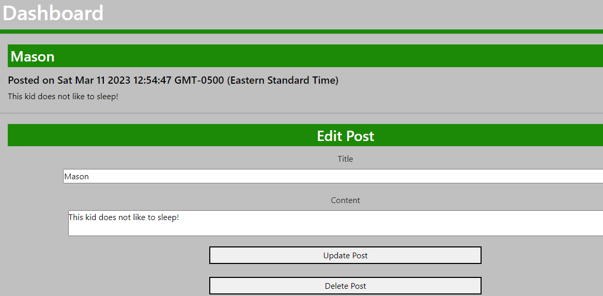

# Fancy_Tech_Blog

## Table-of-Contents

  * [Description](#description)
  * [Installation](#installation)
  * [Usage](#usage)
  * [License](#license)
  * [Contributing](#contributing)
  * [Links](#Links)
  
## [Description](#table-of-contents)
This blog site is for users to share their thoughts, opinions, articles and blog posts in a simple application. All you have to do it first make an account then sign in. From there you can view the home page to view all the latest blogs or go to your dashboard to see all your own blogs. If you click on one of your blogs from your dashboard you can update or delete the blog and if you click on someone else's blog from the home page you can add a comment.

## [Installation](#table-of-contents)
You can clone the code from the github repository and clone it on your computer. Open the file in VS Code. In the root directory of the project, type in the terminal command line 'npm i' to download the dependencies. Initiate the database with 'mysql -u root -p', then 'source db/schema.sql' to create the tables.

## [Usage](#table-of-contents)
Once you create an account or login with your credentials from the login page you are ready to share your thoughts! Once you login you will go directly to your Dashboard where you will see all your previous posts. If you click in one of your previous posts you can edit or delete that post. At the bottom you will see a button to "Create New Blog" which will allow you to create a new blog to post. If you click on the Home button in the top left corner you will be able to all the recent posts from other bloggers. If you click into one of those posts you will be able to leave a comment. To log out, you will need to click the "logout" link in the top corner next to the Dashboard link.

  

  

  

  

  
  
## [license](#table-of-contents)
MIT License

## [Contributing](#table-of-contents)
Contributions will not be accepted at this time.

## [Links](#table-of-contents)

[GitHub](https://github.com/mikestem)

[Deployed Link] (https://secure-everglades-67075.herokuapp.com/)

